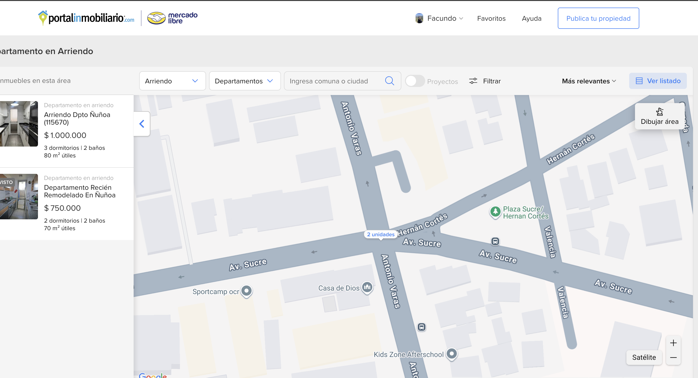
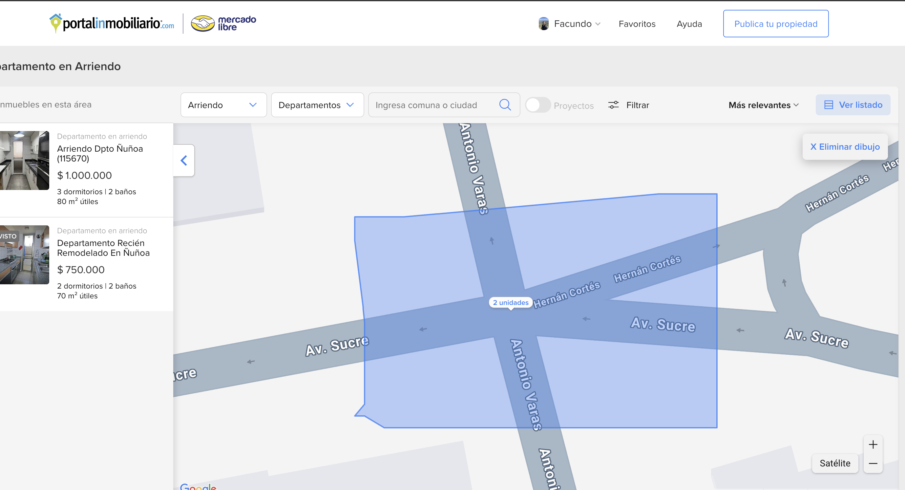

# Monitor de Unidades Inmobiliarias con Notificación por Telegram

Este proyecto es un servicio de monitoreo automatizado que realiza web scraping a un anuncio específico en Portal Inmobiliario para rastrear la cantidad de unidades disponibles. Si detecta un cambio con respecto a la última revisión, o si es la primera vez que se ejecuta, envía una notificación instantánea a través de un bot de Telegram.

## Características

-   **Web Scraping Robusto:** Utiliza `Selenium` para manejar contenido dinámico generado por JavaScript, asegurando que los datos se extraen correctamente.
-   **Detección de Cambios:** Mantiene un estado local para comparar el número de unidades actual con el anterior y notificar solo cuando es necesario.
-   **Notificaciones Instantáneas:** Se integra con la API de Telegram para enviar alertas claras y directas.
-   **Configuración Segura:** Gestiona las credenciales sensibles (tokens de bot) de forma segura a través de un archivo `.env`.
-   **Automatización Flexible:** Incluye guías detalladas para la automatización en macOS y Linux, explicando las mejores prácticas para cada sistema.

---

## Guía de Instalación y Configuración

Siga estos pasos en orden para configurar y poner en marcha el servicio.

### Requisitos Previos

-   Python 3.8 o superior instalado.
-   Acceso a la línea de comandos (Terminal en macOS/Linux).

### Paso 1: Clonar o Descargar el Proyecto

Primero, obtenga los archivos del proyecto en su máquina local.

```bash
# Si usa git
git clone <url-del-repositorio>
cd <nombre-del-repositorio>
```

### Paso 2: Crear y Activar un Entorno Virtual

Es una **práctica esencial** aislar las dependencias del proyecto para no afectar la instalación global de Python.

```bash
# Crear el entorno virtual (la carpeta se llamará 'venv')
python3 -m venv venv

# Activar el entorno virtual
source venv/bin/activate

# (Cuando termines de trabajar, para desactivarlo, simplemente escribe: deactivate)
```

### Paso 3: Instalar las Dependencias

Con el entorno virtual activado, instale todas las librerías necesarias.

```bash
pip install -r requirements.txt
```
*(Nota: Asegúrate de tener un archivo `requirements.txt` en el proyecto con el siguiente contenido):*
```txt
# requirements.txt
requests
beautifulsoup4
python-dotenv
selenium
webdriver-manager
```

### Paso 4: Crear y Configurar el Bot de Telegram

Necesitarás un "Bot Token" para que el script pueda enviar mensajes.

1.  Abre Telegram y busca a `@BotFather`.
2.  Envía el comando `/newbot` y sigue las instrucciones para darle un nombre y un nombre de usuario a tu bot.
3.  Al final, `@BotFather` te dará un **Token de acceso HTTP API**. Cópialo, lo necesitarás en un momento.
4. Crea un archivo en la raíz del proyecto llamado `.env` y agrega el token del bot obtenido en el paso anterior:

   ```env
    # .env
    BOT_TOKEN="[tu_token]"
    ```

### Paso 5: Obtener el `CHAT_ID` Correcto

El `CHAT_ID` es el identificador del destinatario. Para que el bot pueda enviarte mensajes, primero debes iniciar una conversación con él.

1.  **Inicia tu bot:** Busca a tu bot recién creado en Telegram con el link que te facilitó `@BotFather` y envíale un mensaje (haz clic en "Start" o escribe "hola").
2.  **Ejecuta el script de diagnóstico:** Este proyecto incluye un script para obtener tu `CHAT_ID`. Con el entorno virtual activado, ejecuta:
    ```bash
    python get_chat_id.py
    ```
3.  **Sigue las instrucciones:** El script te pedirá que le envíes un nuevo mensaje a tu bot. Hazlo, y la terminal te mostrará tu `CHAT_ID` definitivo. Cópialo.

### Paso 6: Obtener la URL Específica del Edificio

El script requiere una URL especial que contenga las coordenadas del polígono geográfico que has dibujado. Esta es la forma más precisa de asegurar que solo se monitorea un edificio en particular.

1.  Visita la página de arriendos (vista mapa) de [Portal Inmobiliario](https://www.portalinmobiliario.com/arriendo/departamento/_DisplayType_M).

2.  Navega en el mapa hasta encontrar el edificio que deseas monitorear.

3.  En la parte superior derecha del mapa, haz clic en la herramienta **`Dibujar área`**.

    

4.  Dibuja un polígono lo más ajustado posible alrededor del edificio. Esto es **crucial** para que el script solo detecte las unidades de esa ubicación específica.

    

5.  Una vez que dibujes el área, la página generará la URL en tu navegador para incluir las coordenadas del polígono. **Copia esta nueva URL completa**.

6.  Abre tu archivo `.env` y agrega una nueva variable llamada `URL_A_MONITOREAR`. Pega la URL que acabas de copiar como su valor.

    Tu archivo `.env` ahora debería verse así:

    ```env
    # .env
    BOT_TOKEN="[TU_BOT_TOKEN]"
    CHAT_ID="[TU_CHAT_ID]"
    URL_A_MONITOREAR="[URL_COPIADA_DEL_NAVEGADOR]"
    ```
7. Ponle un nombre a la propiedad agregando la variable `NOMBRE_PROPIEDAD` a tu  `.env`. Con este nombre recibirás las notificaciones en Telegram:

  ```env
    # .env
    BOT_TOKEN="[TU_BOT_TOKEN]"
    CHAT_ID="[TU_CHAT_ID]"
    URL_A_MONITOREAR="[URL_COPIADA_DEL_NAVEGADOR]"
    NOMBRE_PROPIEDAD="[NOMBRE_IDENTIFICADOR]"
    ```

### Paso 7: Configurar el Archivo `.env` con BOT Telegram

Este archivo almacenará tus credenciales de forma segura, fuera del código fuente.

1.  Abre el archivo `.env` creado anteriormente.
2.  Pega tu **Chat ID** obtenido en el paso anterior:

    ```env
    # .env
    URL_A_MONITOREAR="[URL_GENERADA_TRAS_DIBUJO_AREA]"
    BOT_TOKEN="[TU_TOKEN_BOT_TELEGRAM]"
    CHAT_ID="[TU_CHAT_ID_BOT_TELEGRAM]"
    ```

---

## Uso

Para probar que todo funciona correctamente, puedes ejecutar el script manualmente.

```bash
# Asegúrate de que tu entorno virtual esté activado
python monitor.py
```

La primera vez que lo ejecutes, deberías recibir una notificación de bienvenida en Telegram, confirmando que la configuración es correcta. En ejecuciones posteriores, solo notificará si hay cambios.

---

## Automatización (Ejecución Diaria)

Para que el script se convierta en un "servicio", debe ejecutarse automáticamente. A continuación se presentan dos métodos.

### Método 1: `cron` (Linux / macOS - Básico)

`cron` es el programador de tareas clásico en sistemas tipo Unix.

1.  Abre tu editor de `crontab` en la terminal:
    ```bash
    crontab -e
    ```
2.  Añade la siguiente línea al final del archivo para ejecutar el script todos los días a las 9:00 AM:
    ```cron
    0 9 * * * cd /ruta/completa/a/tu/proyecto && /ruta/completa/a/tu/proyecto/venv/bin/python monitor.py
    ```
    -   **Importante:** Reemplaza `/ruta/completa/a/tu/proyecto` con la ruta absoluta a la carpeta del proyecto.
    -   El comando `cd` es **crucial** para que el script pueda encontrar el archivo `.env`.
    -   La ruta a Python debe apuntar al ejecutable **dentro de tu entorno virtual**.

#### Limitaciones Importantes de `cron` en macOS

> Si tu Mac está en modo de reposo (con la tapa cerrada) a la hora programada, **el `cron` job no se ejecutará**. `cron` no tiene memoria de las tareas que se perdió mientras el sistema estaba dormido. Para macOS, el método `launchd` es la solución recomendada.

### Método 2: `launchd` (macOS - Recomendado)

`launchd` es el sistema moderno y robusto de Apple para gestionar tareas programadas. Es consciente del estado de energía y ejecutará las tareas perdidas tan pronto como el sistema se despierte.

1.  **Crear el archivo de servicio (`.plist`):**
    Crea un archivo llamado `com.tunombre.mmscrapewatcher.plist` (puedes cambiar "tunombre") y pega el siguiente contenido:

    ```xml
    <?xml version="1.0" encoding="UTF-8"?>
    <!DOCTYPE plist PUBLIC "-//Apple//DTD PLIST 1.0//EN" "http://www.apple.com/DTDs/PropertyList-1.0.dtd">
    <plist version="1.0">
    <dict>
        <key>Label</key>
        <string>com.tunombre.mmscrapewatcher</string>

        <key>ProgramArguments</key>
        <array>
            <string>/ruta/completa/a/tu/proyecto/venv/bin/python</string>
            <string>/ruta/completa/a/tu/proyecto/monitor.py</string>
        </array>

        <key>WorkingDirectory</key>
        <string>/ruta/completa/a/tu/proyecto</string>

        <key>StartCalendarInterval</key>
        <dict>
            <key>Hour</key>
            <integer>9</integer>
            <key>Minute</key>
            <integer>0</integer>
        </dict>

        <key>StandardOutPath</key>
        <string>/ruta/completa/a/tu/proyecto/stdout.log</string>
        <key>StandardErrorPath</key>
        <string>/ruta/completa/a/tu/proyecto/stderr.log</string>
    </dict>
    </plist>
    ```
    -   Nuevamente, reemplaza todas las instancias de `/ruta/completa/a/tu/proyecto` con tu ruta real.

2.  **Mover el archivo a la carpeta de `LaunchAgents`:**
    ```bash
    mv com.tunombre.mmscrapewatcher.plist ~/Library/LaunchAgents/
    ```

3.  **Cargar el servicio:**
    ```bash
    launchctl load ~/Library/LaunchAgents/com.tunombre.mmscrapewatcher.plist
    ```

Tu servicio ahora está correctamente configurado y se ejecutará de forma fiable todos los días.

Puedes forzar una ejecución de prueba con `launchctl start com.tunombre.mmscrapewatcher`.

## Estructura del Proyecto

```
.
├── .env                  # Archivo de configuración con credenciales (NO subir a git)
├── get_chat_id.py        # Script de utilidad para obtener tu Chat ID de Telegram
├── monitor.py            # Script principal de scraping y notificación
├── requirements.txt      # Lista de dependencias de Python
└── README.md             # Esta documentación
```