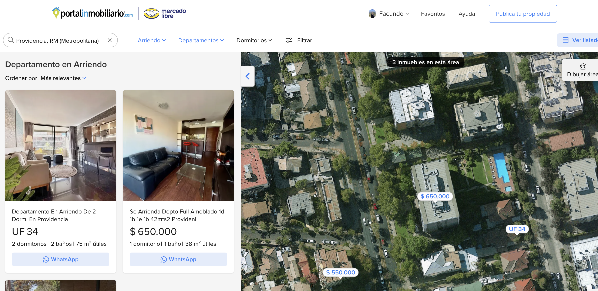
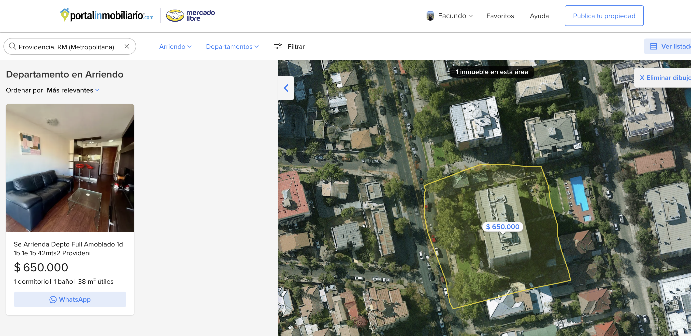

# Monitor de Unidades Inmobiliarias con Notificación por Telegram

Este proyecto es un servicio de monitoreo automatizado que realiza web scraping a un anuncio específico en Portal Inmobiliario para rastrear la cantidad de unidades disponibles. Si detecta un cambio con respecto a la última revisión, o si es la primera vez que se ejecuta, envía una notificación instantánea a través de un bot de Telegram.

## Características

-   **Web Scraping Robusto:** Utiliza `Selenium` para manejar contenido dinámico generado por JavaScript, asegurando que los datos se extraen correctamente.
-   **Detección de Cambios:** Mantiene un estado local para comparar el número de unidades actual con el anterior y notificar solo cuando es necesario.
-   **Notificaciones Instantáneas:** Se integra con la API de Telegram para enviar alertas claras y directas.
-   **Configuración Segura:** Gestiona las credenciales sensibles y los parámetros a través de un archivo `.env`.
-   **Automatización Flexible:** Incluye guías detalladas para la automatización en macOS y Linux, explicando las mejores prácticas para cada sistema.

---

## Guía de Instalación y Configuración

Siga estos pasos en orden para configurar y poner en marcha el servicio.

### Requisitos Previos

-   Python 3.8 o superior instalado.
-   Acceso a la línea de comandos (Terminal en macOS/Linux).

### Paso 1: Obtener el Proyecto

Primero, obtenga los archivos del proyecto en su máquina local.

```bash
# Si usa git
git clone https://github.com/facualex/portalinmobiliario_watch
cd portalinmobiliario_watch
```

### Paso 2: Crear y Activar un Entorno Virtual

Es una **práctica esencial** aislar las dependencias del proyecto para no afectar la instalación global de Python.

```bash
# Crear el entorno virtual (la carpeta se llamará 'venv')
python3 -m venv venv

# Activar el entorno virtual
source venv/bin/activate

# (Cuando termines de trabajar, para desactivarlo, simplemente escribe: deactivate)
```

### Paso 3: Instalar las Dependencias

Con el entorno virtual activado, instale todas las librerías necesarias.

```bash
pip install -r requirements.txt
```

### Paso 4: Configurar los Parámetros y Credenciales (`.env`)

Este archivo centralizará toda la configuración.

#### 4.1. Crear el archivo `.env`
En la raíz del proyecto encontrarás `.env.example`, una plantilla con todas las variables necesarias. Copiala como `.env`:
```bash
cp .env.example .env
```

#### 4.2. Configurar el Bot de Telegram
-   En Telegram, busca a `@BotFather`, envía `/newbot` y sigue las instrucciones para crear tu bot. Copia el **Token HTTP API**.
-   Inicia una conversación con tu nuevo bot (haz clic en "Start").
-   Ejecuta `python get_chat_id.py` en tu terminal, Este script te devolverá tu **Chat ID**. Cópialo.

#### 4.3. Obtener la URL Específica del Edificio
El script requiere una URL especial que contenga las coordenadas del polígono geográfico que has dibujado.

1.  Visita la página de arriendos (vista mapa) de [Portal Inmobiliario](https://www.portalinmobiliario.com/arriendo/departamento/_DisplayType_M).
2.  Navega en el mapa hasta encontrar el edificio que deseas monitorear.
3.  En la parte superior derecha del mapa, haz clic en la herramienta **`Dibujar área`**.

    

4.  Dibuja un polígono lo más ajustado posible alrededor del edificio. Esto es **crucial** para que el script solo detecte las unidades de esa ubicación específica.

    

5.  Una vez que dibujes el área, la página generará una nueva URL en tu navegador. **Copia esta URL completa**.

#### 4.4. Completar el archivo `.env`
Abre el archivo `.env` (creado a partir de `.env.example`) y completa cada variable con la información que recopilaste. Piensa en un nombre corto para la propiedad (ej. "Edificio Manuel Montt") para la variable `NOMBRE_PROPIEDAD`.

Tu archivo final debe verse así:
```env
TELEGRAM_BOT_TOKEN="[TU_BOT_TOKEN_AQUI]"
TELEGRAM_CHAT_ID="[TU_CHAT_ID_AQUI]"
URL_A_MONITOREAR="[URL_COPIADA_DEL_NAVEGADOR]"
NOMBRE_PROPIEDAD="[NOMBRE_IDENTIFICADOR_DE_LA_PROPIEDAD]"
```

---

## Uso Manual (Prueba de Funcionamiento)

Para verificar que toda la configuración es correcta, ejecuta el script manualmente.

```bash
# Asegúrate de que tu entorno virtual esté activado
python monitor.py
```
La primera vez que lo ejecutes, deberías recibir una notificación de bienvenida en Telegram.

---

## Automatización (Ejecución Diaria)

Para que el script se convierta en un "servicio", debe ejecutarse automáticamente. El método depende del sistema operativo:

### Linux / macOS (básico): `cron`

1.  Abre tu editor de `crontab`: `crontab -e`
2.  Añade la siguiente línea para ejecutar el script todos los días a las 9:00 AM:
    ```cron
    0 9 * * * cd /ruta/completa/a/tu/proyecto && /ruta/completa/a/tu/proyecto/venv/bin/python monitor.py
    ```
    -   **Importante:** Reemplaza `/ruta/completa/a/tu/proyecto` con tu ruta absoluta. El `cd` es crucial para que el script encuentre el archivo `.env`.

> **Limitación Importante de `cron` en macOS:** Si tu Mac está en modo de reposo (tapa cerrada) o apagado a la hora programada, **el `cron` job simplemente se salta esa ejecución** y no hay forma de recuperarla. Para macOS, el método `launchd` es la solución recomendada.

### macOS (recomendado): `launchd`

`launchd` es el sistema moderno y robusto de Apple para gestionar tareas programadas. A diferencia de `cron`, cuando usa `StartCalendarInterval` (como en este proyecto), `launchd` recuerda la última vez que corrió la tarea: si el Mac estaba dormido o apagado a la hora programada, en cuanto el equipo vuelve a estar disponible, `launchd` detecta que se perdió una ejecución y la corre en ese momento. Por eso es la opción recomendada para un monitoreo diario confiable en una laptop que no siempre está encendida o despierta a la hora exacta.

**1. Crear Directorio para Logs:**
`launchd` necesita un lugar donde escribir los archivos de salida y error.

```bash
# Desde la raíz de tu proyecto
mkdir launchd
chmod 755 launchd
```

**2. Crear el Archivo de Servicio (`.plist`):**
Crea un archivo llamado `com.tunombre.mmscrapewatcher.plist` (cambia "tunombre") y pega el siguiente contenido. Asegúrate de actualizar las rutas.

```xml
<?xml version="1.0" encoding="UTF-8"?>
<!DOCTYPE plist PUBLIC "-//Apple//DTD PLIST 1.0//EN" "http://www.apple.com/DTDs/PropertyList-1.0.dtd">
<plist version="1.0">
<dict>
    <key>Label</key>
    <string>com.tunombre.mmscrapewatcher</string>
    <key>ProgramArguments</key>
    <array>
        <string>/ruta/completa/a/tu/proyecto/venv/bin/python</string>
        <string>/ruta/completa/a/tu/proyecto/monitor.py</string>
    </array>
    <key>WorkingDirectory</key>
    <string>/ruta/completa/a/tu/proyecto</string>
    <key>StartCalendarInterval</key>
    <dict>
        <key>Hour</key>
        <integer>9</integer>
        <key>Minute</key>
        <integer>0</integer>
    </dict>
    <key>StandardOutPath</key>
    <string>/ruta/completa/a/tu/proyecto/launchd/stdout.log</string>
    <key>StandardErrorPath</key>
    <string>/ruta/completa/a/tu/proyecto/launchd/stderr.log</string>
</dict>
</plist>
```

**3. Mover y Cargar el Servicio:**
```bash
# Mover el archivo
mv com.tunombre.mmscrapewatcher.plist ~/Library/LaunchAgents/

# Cargar el servicio en launchd
launchctl load ~/Library/LaunchAgents/com.tunombre.mmscrapewatcher.plist
```
Tu servicio ahora está correctamente configurado. Puedes forzar una ejecución de prueba con `launchctl start com.tunombre.mmscrapewatcher`.

### Windows: Programador de Tareas

Windows no tiene `cron`; su equivalente nativo es el **Programador de Tareas** (Task Scheduler). Como `python-dotenv` busca el archivo `.env` a partir del directorio de trabajo actual, es fundamental que la tarea se ejecute posicionada en la carpeta del proyecto, no solo que se invoque el script.

**1. Crear un archivo `.bat` que fije el directorio de trabajo:**

En la raíz del proyecto, crea `run_monitor.bat`:
```bat
@echo off
cd /d "C:\ruta\completa\a\tu\proyecto"
"C:\ruta\completa\a\tu\proyecto\venv\Scripts\python.exe" monitor.py
```
-   **Importante:** Reemplaza `C:\ruta\completa\a\tu\proyecto` con la ruta absoluta real de tu proyecto en ambas líneas.

**2. Programar la tarea con `schtasks` (línea de comandos):**

Abre `cmd.exe` o PowerShell como el usuario que ejecutará la tarea y corre:
```cmd
schtasks /create /tn "PortalInmobiliarioWatch" /tr "C:\ruta\completa\a\tu\proyecto\run_monitor.bat" /sc daily /st 09:00
```
-   `/sc daily /st 09:00` programa la ejecución diaria a las 9:00 AM. Ajusta el horario a tu preferencia.
-   Puedes forzar una ejecución de prueba con: `schtasks /run /tn "PortalInmobiliarioWatch"`
-   Para eliminar la tarea: `schtasks /delete /tn "PortalInmobiliarioWatch" /f`

**3. Alternativa por interfaz gráfica:**

Si prefieres no usar la línea de comandos, abre **Programador de Tareas** (busca "Task Scheduler" en el menú de inicio) y crea una tarea básica:
-   **Desencadenador:** Diario, a la hora que prefieras.
-   **Acción:** "Iniciar un programa", apuntando a `run_monitor.bat`.
-   En **Opciones avanzadas** de la acción, asegúrate de que **"Iniciar en" (Start in)** apunte a la carpeta del proyecto — esto reemplaza al `cd /d` del `.bat` si prefieres invocar `python.exe` directamente en vez del script `.bat`.
-   En la pestaña **Condiciones**, si tu equipo suele estar en suspensión, habilita **"Reactivar el equipo para ejecutar esta tarea"**.

## Estructura del Proyecto

```
.
├── .env                  # Archivo de configuración (NO subir a git)
├── .env.example          # Plantilla de configuración (sí se sube a git)
├── get_chat_id.py        # Script de utilidad para obtener el Chat ID
├── img/                  # Carpeta con imágenes para la documentación
│   ├── 1.png
│   └── 2.png
├── launchd/              # Carpeta para los logs de la automatización en macOS
├── monitor.py            # Script principal de scraping y notificación
├── requirements.txt      # Lista de dependencias de Python
├── ultimo_recuento.txt   # Estado local con el último recuento (se genera solo)
└── README.md             # Esta documentación
```